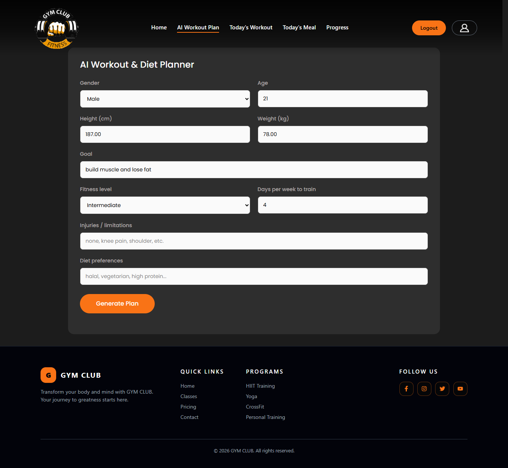
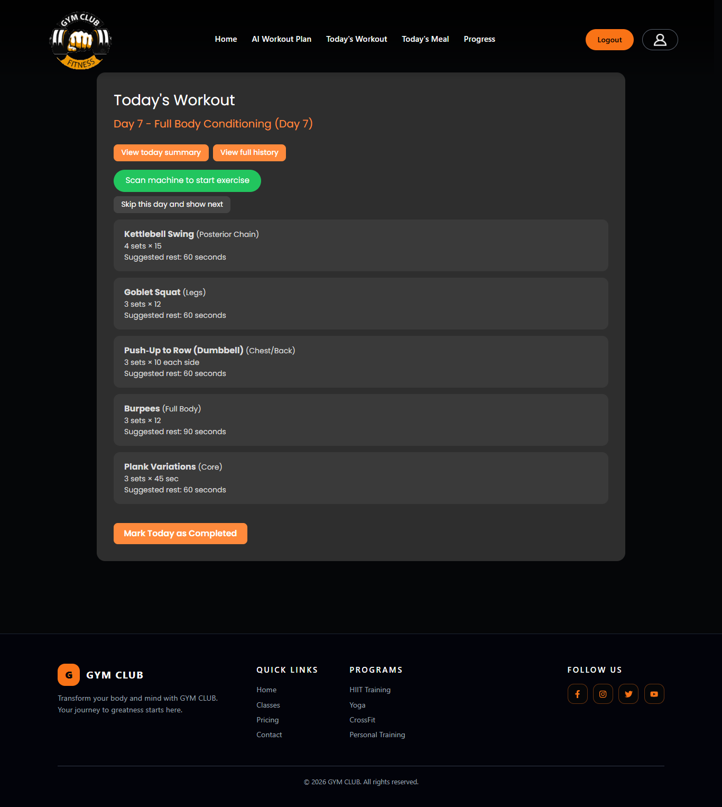

🏋️‍♂️ FYP – AI-Powered Gym Management System

An intelligent full-stack gym management platform that combines AI-powered workout planning, machine tracking with QR codes, and fitness analytics to deliver a modern gym experience.

🚀 Features
JWT Authentication
Categories & video content
Favorites system
AI integration using Clarifai (OpenAI-compatible API)
📦 Project Setup
🖥️ Backend Setup (Laravel)
1. Navigate to backend
cd backend
2. Install dependencies
composer install
3. Create .env file
cp .env.example .env
4. Configure .env

Open the .env file and update the following:

🔐 App Configuration
APP_NAME="fyp-backend"
APP_ENV=local
APP_DEBUG=true
APP_URL=http://localhost
🔑 AI Setup (VERY IMPORTANT)

This project uses Clarifai with OpenAI-compatible API.

👉 Step 1: Create a Clarifai Account
Go to: https://www.clarifai.com/
Sign up / log in
Go to your dashboard
Generate your Personal Access Token (PAT)
👉 Step 2: Add Clarifai Keys to .env

Replace the values in your .env:

CLARIFAI_PAT=your_clarifai_pat_here
CLARIFAI_BASE_URL=https://api.clarifai.com/v2/ext/openai/v1
CLARIFAI_MODEL=https://clarifai.com/openai/chat-completion/models/gpt-oss-120b

⚠️ Without this, AI features will NOT work.

🗄️ Database Setup
1. Configure database

Update:

DB_CONNECTION=mysql
DB_HOST=127.0.0.1
DB_PORT=3306
DB_DATABASE=fyp-backend
DB_USERNAME=root
DB_PASSWORD=
2. Run migrations
php artisan migrate
3. Run queue & session tables (IMPORTANT)

Since your app uses database sessions & queues:

php artisan session:table
php artisan queue:table
php artisan migrate
🔐 JWT Setup

Generate JWT secret:

php artisan jwt:secret

This will update:

JWT_SECRET=your_generated_secret
▶️ Run Backend
php artisan serve

📂 Project Structure
backend/
├── app/
├── routes/
├── database/
├── public/
├── storage/
└── .env.example

frontend/
├── src/
├── public/
├── package.json
└── .env.example

Important variables you need to configure in .env:

APP_NAME=
APP_URL=

DB_DATABASE=
DB_USERNAME=
DB_PASSWORD=

CLARIFAI_PAT=
JWT_SECRET=

👉 Use .env.example as a reference.

🔗 API Endpoints
🔐 Auth

POST /auth/register

POST /auth/login

GET /auth/me

POST /auth/logout

🏋️ Machines

GET /machines

GET /machines/{id}

POST /machines

POST /machines/{id}/generate-qr

🤖 AI

POST /ai/workout-plan

📊 Workouts & Metrics

POST /workout-programs/{id}/start

GET /fitness-metrics

POST /fitness-metrics

🖼️ QR Code Feature

Each machine generates a QR code that:

Encodes the machine name

Links to machine details

Can be scanned via mobile devices or drop the svg file created inside Public/Qr file when you post a new machine

👥 Contributors

👨‍💻 Charbel Wehbe

👨‍💻 Manuel Mallo

📸 Screenshots
### LandingPage

### Generate A Plan Page

### Today's Workout Page

### ScanQr

🎯 Future Improvements

📱 Mobile app (React Native)

🧠 Improved AI recommendations

📊 Advanced analytics dashboard

☁️ Cloud deployment (AWS / DigitalOcean)

📄 License

This project is for educational purposes.